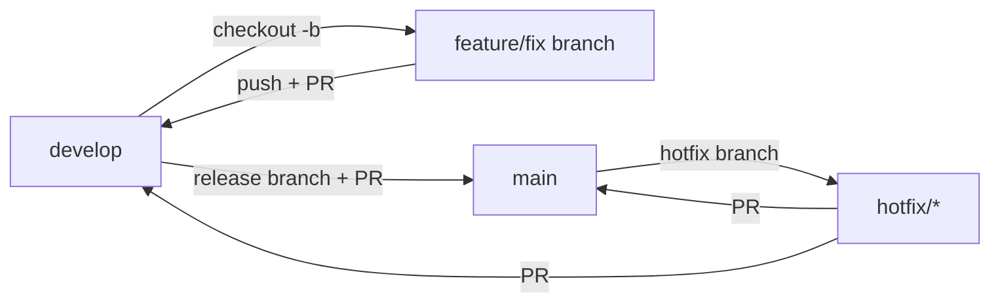

# Gitflow Policy

This repository (and, via the tooling below, most repos owned by `abrioso`) follows **gitflow**
branching with mandatory pull requests. Direct commits/pushes to `main` and `develop` are blocked
both locally and on GitHub.

## Branches

| Branch | Purpose | Merges into |
|--------|---------|-------------|
| `main` | Stable releases | — |
| `develop` | Next release integration | `main` (via release PR) |
| `feature/*` | New functionality | `develop` |
| `fix/*` | Non-urgent fixes | `develop` |
| `hotfix/*` | Critical fixes | `main` + `develop` |
| `release/*` | Release prep | `main` |



## How enforcement works

- **Local git hooks** (`git-hooks/pre-commit`, `git-hooks/pre-push`): block direct commits/pushes
  to `main`/`develop`. Wired up globally via the `core.hooksPath` entry in `git-variables.json`,
  applied by `Apply-GitConfig.ps1`, so the policy covers every repo on the machine, not just this
  one. Bypass only in an emergency: `GITFLOW_HOOK_BYPASS=1 git commit ...`.
- **GitHub branch protection**: `main`/`develop` reject direct pushes server-side (PR required,
  `enforce_admins` on) even from another machine or collaborator. Applied with
  `powershell-scripts/Set-GitflowBranchProtection.ps1 -Repos 'owner/repo', ...`. Note: GitHub's
  free plan only allows branch protection on public repositories.

## Day-to-day workflow

### New feature or non-urgent fix

```powershell
git checkout develop
git pull origin develop
git checkout -b feature/short-description   # or fix/short-description

# ...make changes, commit with conventional commits...
git add <files>
git commit -m "feat: describe the change"

git push -u origin feature/short-description
gh pr create --base develop --title "feat: ..." --body "What/why"
```

Merge the PR on GitHub (or `gh pr merge`), then delete the branch.

### Urgent production fix (hotfix)

```powershell
git checkout main
git pull origin main
git checkout -b hotfix/short-description
# fix, commit, push
gh pr create --base main --title "fix: ..."
# after merging to main, also open a PR from hotfix/* into develop to keep it in sync
```

### Release prep

```powershell
git checkout develop
git checkout -b release/x.y.z
# version bumps, final fixes
gh pr create --base main --title "release: x.y.z"
# after merging to main, tag it, then merge main back into develop
```

## Commit messages

Use [Conventional Commits](https://www.conventionalcommits.org/): `feat:`, `fix:`, `docs:`,
`chore:`, `refactor:`.
