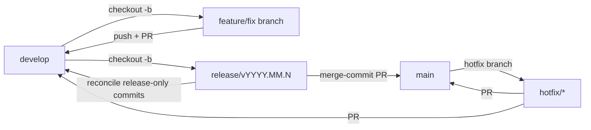

# Gitflow Policy

This repository (and, via the tooling below, most repos owned by `abrioso`) follows **gitflow**
branching with mandatory pull requests. Direct commits/pushes to `main` and `develop` are blocked
both locally and on GitHub.

## Branches

| Branch | Purpose | Merges into |
|--------|---------|-------------|
| `main` | Stable releases | — |
| `develop` | Next release integration | `main` (via release PR) |
| `feature/*` | New functionality | `develop` |
| `fix/*` | Non-urgent fixes | `develop` |
| `hotfix/*` | Critical fixes | `main` + `develop` |
| `release/*` | Release prep and stabilization | `main` and, when needed, `develop` |



## How enforcement works

- **Local git hooks** (`git-hooks/pre-commit`, `git-hooks/pre-push`): block direct commits/pushes
  to `main`/`develop`. To activate, set `core.hooksPath` to the absolute path of the `git-hooks`
  folder in your local `git-variables.json` (the value is empty in `git-variables.json.example`
  and skipped by `Apply-GitConfig.ps1` unless you fill it in). Once set, `Apply-GitConfig.ps1`
  wires the hooks globally so the policy covers every repo on the machine, not just this one.
  Bypass only in an emergency: `GITFLOW_HOOK_BYPASS=1 git commit ...`.
- **GitHub branch protection**: `main`/`develop` reject direct pushes server-side (PR required,
  `enforce_admins` on) even from another machine or collaborator. Applied with
  `powershell-scripts/Set-GitflowBranchProtection.ps1 -Repos 'owner/repo', ...`. Note: GitHub's
  free plan only allows branch protection on public repositories.

## Day-to-day workflow

### New feature or non-urgent fix

```powershell
git checkout develop
git pull origin develop
git checkout -b feature/short-description   # or fix/short-description

# ...make changes, commit with conventional commits...
git add <files>
git commit -m "feat: describe the change"

git push -u origin feature/short-description
gh pr create --base develop --title "feat: ..." --body "What/why"
```

Merge the PR on GitHub (or `gh pr merge`), then delete the branch.

### Urgent production fix (hotfix)

```powershell
git checkout main
git pull origin main
git checkout -b hotfix/short-description
# fix, commit, push
gh pr create --base main --title "fix: ..."
# after merging to main, also open a PR from hotfix/* into develop to keep it in sync
```

### Release prep

```powershell
git fetch --prune origin
git checkout develop
git pull --ff-only origin develop
git checkout -b release/v2026.08.0

# Apply only release stabilization changes, then push the branch.
git push -u origin release/v2026.08.0
gh pr create --base main --head release/v2026.08.0 --title "release: v2026.08.0"
```

Release versions use Calendar Versioning in the form `vYYYY.MM.N`:

- `YYYY` is the four-digit release year.
- `MM` is the zero-padded release month.
- `N` is a non-negative release number within that month, starting at `0`; when a
  date-oriented release identifier is useful, `N` may intentionally use the day of the month.
- Examples: `v2026.08.0` for the first August 2026 release, `v2026.08.1` for a second
  release in that month, or `v2026.08.23` when the final component is mapped to the day.

Before opening the production PR, complete the acceptance matrix in
[RELEASE_TESTING.md](RELEASE_TESTING.md) against the exact release-branch commit. Merge the
release PR into `main` with a **merge commit**, not squash or rebase, so the production release
boundary remains visible.

Keep the release branch until reconciliation is complete:

1. If the release branch contains stabilization commits not already in `develop`, open a second
   PR from the same `release/vYYYY.MM.N` branch into `develop` and merge it with a merge commit.
2. If there are no release-only commits, verify that the branch adds nothing to `develop`; do not
   create an empty reconciliation PR.
3. Tag the merge commit on `main` with the exact `vYYYY.MM.N` version and publish the matching
   GitHub Release.
4. Delete the release branch only after `main`, `develop`, the tag, and the GitHub Release have
   all been verified.

Do not merge `main` wholesale back into `develop` as a substitute for reconciling the release
branch. Hotfixes continue to use their own explicit backport PR into `develop`.

## Commit messages

Use [Conventional Commits](https://www.conventionalcommits.org/): `feat:`, `fix:`, `docs:`,
`chore:`, `refactor:`.
